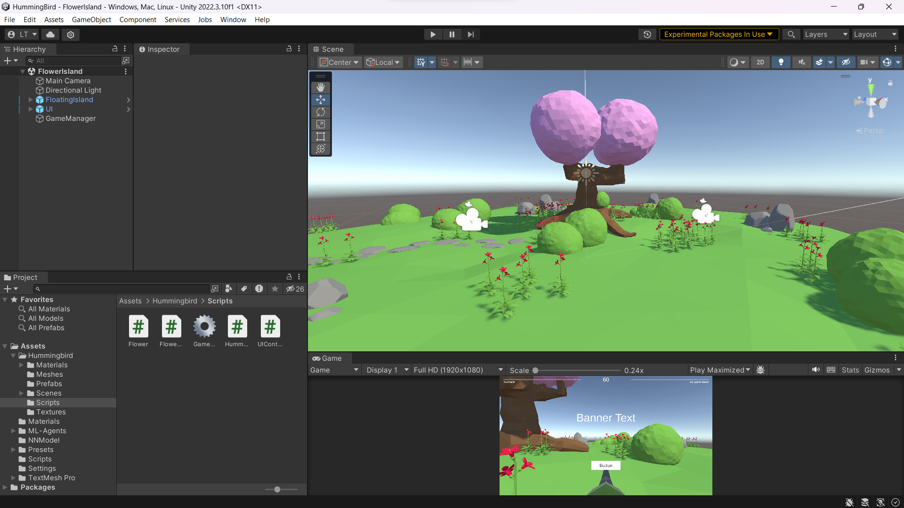
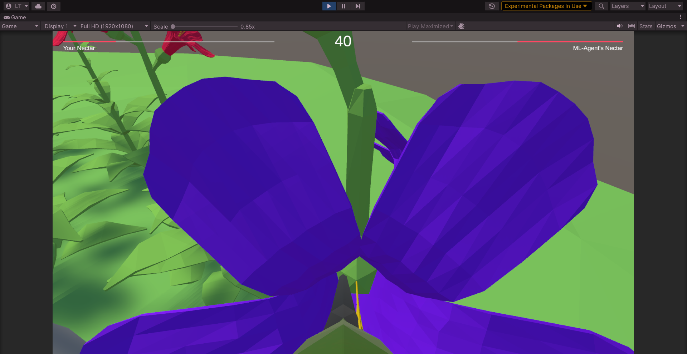
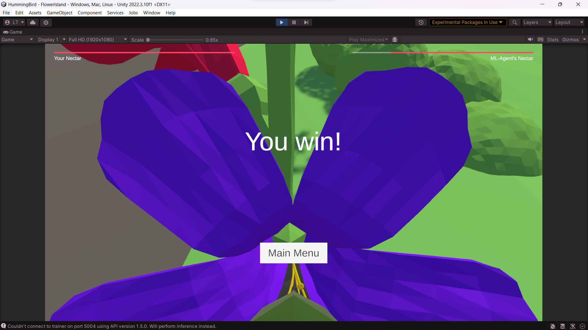

# Hummingbird
**Hummingbird** - Minigame of player competing against Reinforcement learning ML model

<ins>Gameplay</ins>: Player as Hummingbird competes against AI Hummingbird at absorbing the most nectar from multiple flowers

<ins>Vision</ins>: first-person view

<ins>Control</ins>: 
- Mouse movement: PITCH and YAW
- WASD + Ctrl + Space: 3D translation

`InstallationLog.txt` is included for personal use to keep track of what was done. However it is set to public in case anyone encounters same issue to consult.

<ins>Note</ins>: The reason why the training environment is installed in **WSL** Ubuntu is that, there seems to be some dependency issues in Windows since ML-Agents Toolkit is not supported anymore. Training inside WSL would be limited since WSL2 would by default limit RAM usage to maximum only ~50% of the user's hardware.
(to check Memory and Swap space allocated to WSL, run `free -h --giga` within WSL distribution)

Some images:

**CREDIT**: ML-Agents course on Unity Learn platform, instructed by Adam Kelly
